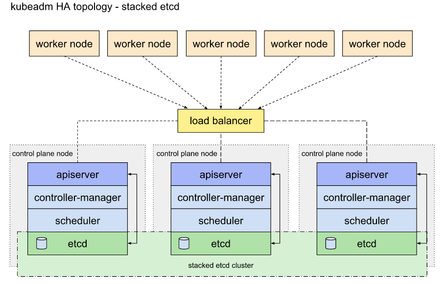
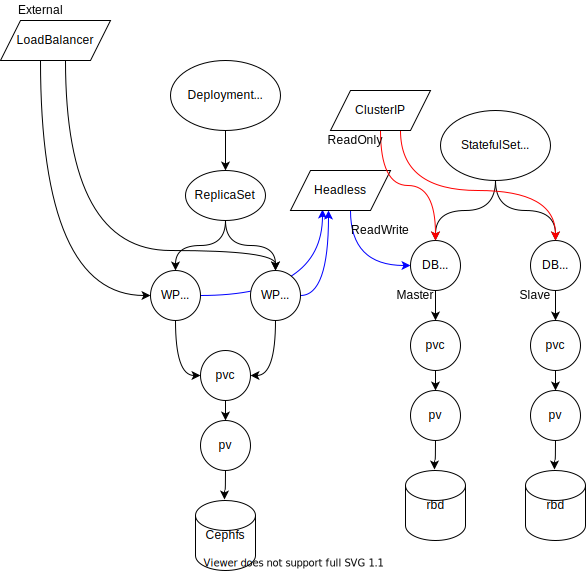

# Go to Kubernetes Native
# Architeuctures
- [Kubernetes-Native-Webapp](https://github.com/namhj94/Kubernetes-Native-Wordpress-Application-Configuration)
      

- [HA Cluster](https://github.com/namhj94/Create-High-Availability-Clusters-with-kubeadm)
    

- [Ingress with customed web services](Configuration-ingress)
    

- [Wordpress-MySQL](Configuration-wp-db)
    

# Resources
- Pod
- ReplicaController
- ReplicaSet
- Service: ClusterIP, NodePort, LoadBalancer, Headless
- Volume: EmptyDir, gitRepo, hostPath
- PV, PVC (Static and Dynamic)
- Ingress
- Deployment
- StatefulSet
- HPA
- configMap
- etc..
