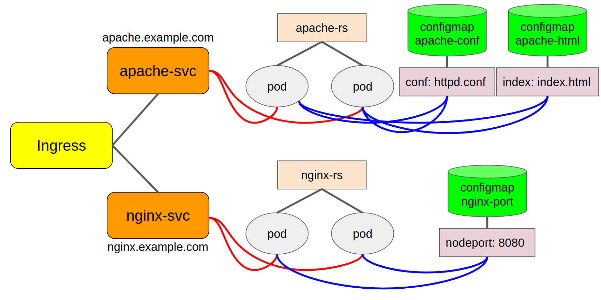

# Kubernetes의 다양한 Workloads 및 Architecture 저장소 입니다.
## Kubernetes Native 혹은 다양한 플랫폼에서 사용할 수 있는 Object들의 Manifest를 관리합니다.
# Platform
- minikube
- k8s in docker for desktop
- AKS
# Resources
- Pod
- ReplicaController
- ReplicaSet
- Service: ClusterIP, NodePort, LoadBalancer, Headless
- Volume: EmptyDir, gitRepo, hostPath
- PV, PVC (Static and Dynamic)
- Ingress
- Deployment
- StatefulSet
- HPA
- configMap
# Architeuctures
### Kubernetes-Native-Webapp
- [Details](https://github.com/namhj94/Kubernetes-Native-Wordpress-Application-Configuration)
  

### HA Cluster
- [Details](https://github.com/namhj94/Create-High-Availability-Clusters-with-kubeadm)
    

### Ingress with customed web services
- [Details](Configuration-ingress)
    

### Wordpress-MySQL
- [Details](Configuration-wp-db) 
    
