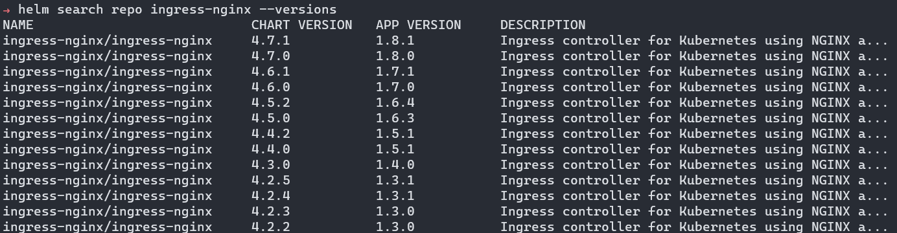
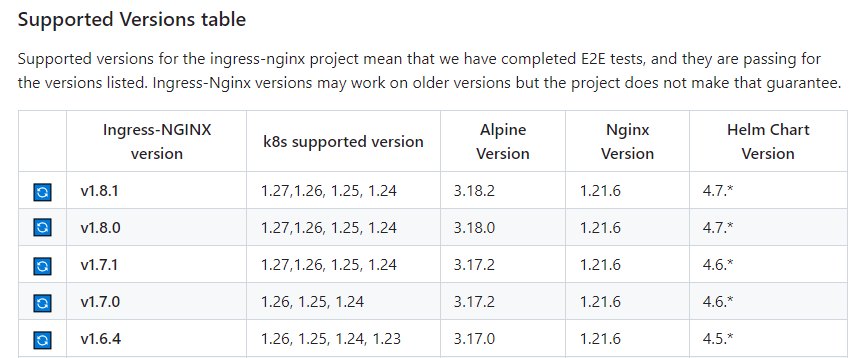

# Ingress Nginx Controller
- Ingress Nginx Official Repo = https://github.com/kubernetes/ingress-nginx
- AKS Docs = https://learn.microsoft.com/ko-kr/azure/aks/ingress-basic?tabs=azure-cli

# Step
0. Helm repo setup
```
helm repo add ingress-nginx https://kubernetes.github.io/ingress-nginx
```
1. Create Namespace
```
k create ns ingress-nginx
```
2. Customize Values
```
helm show values ingress-nginx/ingress-nginx > values.yaml

cp values.yaml user-values.yaml
vi user-values.yaml
# AKS
controller:
  service:
    annotations: 
      service.beta.kubernetes.io/azure-load-balancer-health-probe-request-path: /healthz

```
*Option: Specific version install
```
helm search repo ingress-nginx --versions
helm install ingress-nginx ingress-nginx/ingress-nginx --version 4.5.2 -n ingress-nginx -f user-values.yaml
```




3. Install with user-values.yaml
```
helm install ingress-nginx ingress-nginx/ingress-nginx -n ingress-nginx -f user-values.yaml
```

4. Check installation
```
# Check Installed chart(release)
helm ls -n ingress-nginx

# Check value (user values)
helm get values ingress-nginx -n ingress-nginx
```

*Update to specific version
```
helm upgrade -n ingress-nginx ingress-nginx ingress-nginx/ingress-nginx --version 4.7.0
```